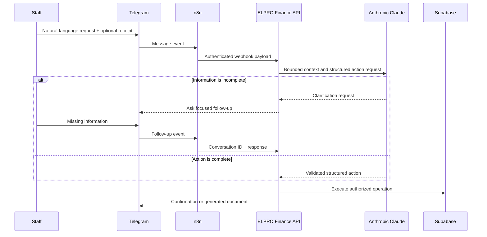
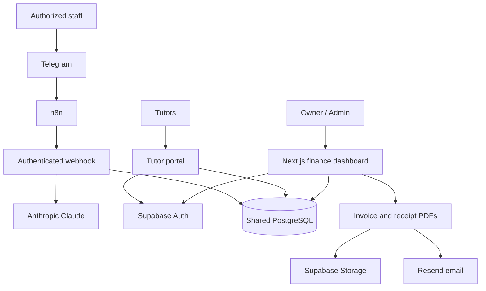

# ELPRO Finance

> An internal finance and business-operations platform with a conversational AI assistant.

[Alexander Kosasih](https://www.linkedin.com/in/alexander-kosasih) · Part of the [ELPRO Music Lab](https://elpromusiclab.com) ecosystem

## Overview

ELPRO’s revenue, expenses, private-student billing, receipts, and tutor compensation were spread across bank records, messages, spreadsheets, and memory. This made it difficult to answer basic operating questions confidently:

- How much did the business earn this month?
- Which costs belong to the current accounting period?
- What is the current profit and cash-flow position?
- Which students have paid?
- What should each tutor be paid?
- Can routine administration happen from a phone without opening a dashboard?

I designed and built ELPRO Finance as a separate internal application connected to the same Supabase data layer as the customer-facing platform.

## Why a separate application?

The customer platform and internal finance system have very different risk profiles and users.

Separating them provides:

- Deployment isolation
- Smaller authorization surface
- Clearer ownership of finance workflows
- Reduced risk that an internal feature affects customer checkout
- Shared data without duplicating the source of truth

## What I built

### Financial visibility

- Income and expense ledgers
- Period-based reporting
- Profit-and-loss dashboard
- Cash-flow reporting
- Category and business-unit breakdown
- Receipt attachment storage
- CSV export
- Bank-balance settings

### Private-student operations

- Student onboarding
- Multi-instrument pricing
- Session logging
- Monthly billing
- Group and home-visit rules
- Payment confirmation
- PDF invoice generation
- Official receipt generation and email delivery

### Tutor operations

- Role-specific tutor portal
- Assigned-student visibility
- Monthly payroll estimation
- Per-student and per-instrument compensation
- Group transport-fee deduplication
- Historical payroll views

### Jiva — Telegram AI operations assistant

Jiva allows authorized team members to perform structured business operations from natural-language Telegram messages.

Supported workflows include:

- Recording expenses and income
- Reading receipt or payment-proof attachments
- Asking follow-up questions when information is incomplete
- Onboarding private students
- Logging monthly sessions
- Generating invoices
- Confirming payments
- Notifying the owner of important actions

## Conversational workflow

## System architecture

## Important design decisions

### Accounting period is not always payment date

Operational reporting needed accrual-style period assignment. A bill paid in June may belong to May. I modeled `period_month` separately from transaction dates and fixed reporting views that incorrectly grouped private revenue by payment date.

### AI proposes actions; application code enforces them

The language model does not receive unrestricted database authority. It produces a constrained action shape. Server code validates roles, enums, identifiers, attachments, amounts, and business rules before any write.

### Conversations need durable clarification state

Financial messages are often incomplete: “Zoom this month 235k” may lack a date, category, or proof. Jiva stores short-lived conversation state and returns a conversation identifier so a later message can complete the same action.

### Financial documents need distinct semantics

An invoice, transfer proof, and official paid receipt are not the same artifact. The system keeps separate storage paths, numbering, generation rules, and delivery behavior for each.

## Selected production challenges

### Reconciling real bank activity

I used the platform to reconcile monthly bank activity against internal expense records, identify duplicates and missing transactions, preserve intentional accrual differences, and link receipt evidence to the correct records.

### Multi-instrument and group pricing

Private students can study multiple instruments, share home visits, or belong to a family group. Naive per-row calculations created incorrect totals and duplicate transport fees. Pricing and payroll logic were revised to attribute instruments explicitly and charge shared fees once.

### Preventing duplicate receipt emails

Group payments can represent more than one student. Receipt delivery is deduplicated by payer so the same confirmation does not generate multiple emails.

## Security and privacy

- Finance-specific role guards
- Server-side administrative client only
- Authenticated Telegram webhook
- Telegram sender allowlist
- File type and size validation
- Structured AI outputs
- Markdown sanitization before Telegram responses
- Confirmation steps before payment-state changes
- Private storage for receipts and billing documents
- No production financial data is included in this case study

## Technology

Next.js · React · TypeScript · Supabase · PostgreSQL · Anthropic Claude · Telegram Bot API · n8n · React PDF · Resend · Recharts · Vercel

## Outcome

ELPRO Finance replaced fragmented financial administration with a shared operational system. It gives the team clearer financial visibility, standardizes billing and payroll, and lets authorized staff complete routine workflows conversationally from Telegram.

## Repository note

The production repository is private. This public case study intentionally excludes customer identities, bank data, revenue figures, credentials, and proprietary pricing rules.
